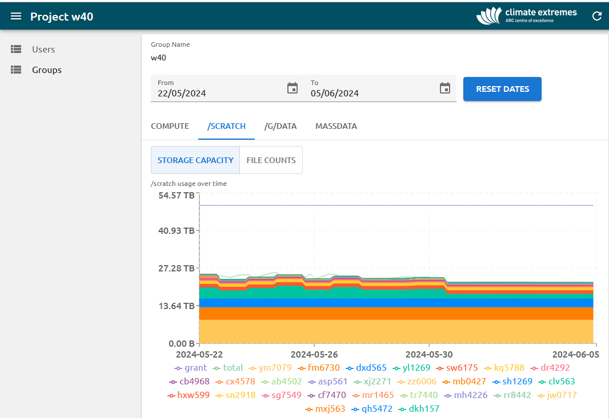

# Storage - where, what, why and how?

Simulations, analysis, modelling, use and/or create data.

Space is limited: need to optimise storage. 

**Where** is the largest disk usage

**What** is using up the disk space

**Why** is it there (data triage: maybe you no longer need it) 

**How** can you reduce your usage to make room for MORE!


## Where

Find your disk storage quotas and usage in one hit:
```
lquota
```
More detail for a single project is available using the `nci_account` command
```
nci_account -P project_id
```
To query usage for an on-disk file system, NCI provides commands which report on filesystem usage, updated daily. On NCI systems, it is the project owning a file that determines how it is accounted for, not where the file resides on the filesystem
```
nci-files-report --group project_id
```

CMS has put in place a dashboard for visualising a range of accounting statistics for CLEX. Please contact CMS for the passowrd to access [this server](http://climate-cms.org/dashboard/) 



More details on how to use these and other accounting tools are available from the [CMS wiki](http://climate-cms.wikis.unsw.edu.au/Accounting_at_NCI).

## What?

When you know where to look, to find out what is using all the disk space, you can use `ls`, `du` and `find`
```
ls -lSrh dir
du -shc dir/* | sort -h
for d in dir/*; do echo $(find $d | wc -l) $d; done | sort -n
```
But there is a better tool: `ncdu`
```
ncdu directory_name
```
`ncdu` crawls the directory you point it at, collects all the information about the files and directories, and presents this as a curses based interactive program. Using the arrow keys and navigating to another directory shows a view of the storage usage in that directory.
Press '?' to get help on the options available. 'g' changes the layout. 'C' lists by numbers of items. 'c' will show how many items there are in a directory.

Once you've found the files taking the space, you need to find out what are they? The unix command `file` can help in some cases
```
file filename
```
It will correctly identify `netCDF4`, and `grib`, but not `netCDF3` or UM history files.

To see what is inside a UM history file, netCDF file, grib file (as some examples of common data file types):
```
xconv history_file
ncdump -hs netcdf_file
grib_ls grib_file
```
On May 2022 NCI started the [purging of old files on /scratch](https://protect-au.mimecast.com/s/wd_aC6X1k7Cr7wn0zipvCNT?domain=opus.nci.org.au). `nci-file-expiry` is the new tool NCI provides for users to check which files will expire soon, which have been quarantined and how to get them out of quarantine.
To check which files will expire soon use:
```
nci-file-expiry list-warnings
```
To see all the available options:
```
nci-file-expiry -h
```   
## Why?

Why do I produce this data? If you're running a model: check the diagnostics (output variables) being 
produced. Do you need them all? Before starting a run, check you will have enough space to store all the data produced.

Analysing data: does your workflow involve:

* making copies of locally accessible data?
* creating transformed intermediate copies of data?

Explore other approaches! You may be needlessly making multiple copies of data when a different approach could eliminate this. An example is the powerful python library `xarray`, which can open multiple files as a single data set which can be subset easily in time and space.

## How?

How can I use less disk space? Data triage: Why am I storing these files?

### Archive if:

* no longer require fast access, e.g. raw data that has been analysed

### Delete if:

* you don't remember what the data is or comes from
* not required, as in case of failed simulations
* duplicates of data available with similar access time (on disk, readable) or with a longer access time (mass data, off-site) if no longer require fast access
* intermediate data for analysis (keep scripts to regenerate under version control, ideally on GitHub or similar)

## How can I use less disk space for the files/fields I must keep?
### Netcdf files

**Compression!**

netCDF4 has lossless internal compression (transparent to user) which is typically half to a quarter of the same data uncompressed. 

Output compressed netCDF4 directly from models/analysis where possible.

Otherwise use compression tools.

nccompress can be used to batch compress netcdf files. To access this command:
```
module use /g/data3/hh5/public/modules
module load conda
```
```
nccompress -r -o -p -b 500 directory_name
```
For help on all available options:
```
nccompress -h
```

**Packing**

You can reduce the precision of netCDF data, known as packing.

The CF conventions have standard attributes that CF compliant tools support: variable attributes `scale_factor` and `add_offset` are used to reduce the precision of the variable. Generally, halves size of file. 

Packing is more reliable when data is produced, as problems can be corrected, and data regenerated. We don't recommend packing existing data: it is lossy and there is high potential for corruption, but if you must, `nco` (`module load nco`) has a tool for packing
```
ncpdq -L 5 infile.nc outfile.nc

```
**Bit Grooming: Precision-Preserving Compression**

[Bit grooming](https://gmd.copernicus.org/articles/9/3199/2016/) is a form of precision-preserving compression, similar to packing, but does not suffer from the degradation of precision within the narrow dynamic range of values chosen. It is an active area of research, and new algorithms/approaches are being developed. Generally, these approaches remove spurious precision from scientific data, usually model output, that has no informational value, and by doing so makes the data more compressible. In a real-world application the data was less than half the size of the same data only using compression.

### UM history files
UM history files can be compressed with tools like gzip, but this can be time consuming, and the file must be uncompressed before using.
Alternatively convert to compressed netCDF4.
```
module use /g/data/access/projects/access/modules/
module load pythonlib/um2netcdf4
um2netcdf4.py -i um_file -o um_file.nc -k 4 -d 5
```
### ACCESS model output
Chloe Mackallah (CSIRO) created a very useful tool to help sorting the ACCESS model output: the [ACCESS Archiver](https://git.nci.org.au/cm2704/ACCESS-Archiver).
```{admonition} From the documentation:
The ACCESS Archiver is designed to archive model output from ACCESS simulations. Its focus is to copy ACCESS model output from its initial location to a secondary location (typically from /scratch to /g/data), while converting UM files to netCDF, compressing MOM/CICE files, and culling restart files to 10-yearly. Saves 50-80% of storage space due to conversion and compression.
Supported versions are CM2 (coupled, amip & chem versions), ESM1.5 (script & payu versions), OM2[-025]
```
Please note that you need to use your NCI credential to get access to the repository.

### Text files and binary
Text files and binary files generally compress well, a lot of redundant information. This is lossless compression
```
gzip textfile
```
Will create `textfile.gz` and delete the original file.

To uncompress
```
gunzip textfile.gz
```

## How can I reduce the number of files I store?
There is a limit on inodes (number of files) on NCI machine. If you are close to this limit you need to reduce the number of files you are storing.

One solution if you have a large number of netCDF files is to aggregate them. 

Some models produce large numbers of files, e.g. one per time step. Dimensional information and metadata are repeated, so it is redundant, this approach can save a lot of storage space as well.

Use `nco` (`module load nco`)
```
ncecat *.nc -O merged.nc
```
and once you are satisfied the merged data is correct, delete the original data files.

If you have a large number of text files (logs etc) you can use `tar`:
```
tar -zcvf tarfile.tar.gz directory_name
```
This will put all the files in a single tape archive file and compress everything on the fly. Once again, the originals must be deleted, or optionally you can use the `--remove-files` command line option to remove the files as they are added to the archive.

To see the contents of a tar file:
```
tar -ztvf tarfile.tar.gz
```
and to uncompress and restore all files
```
tar -xvf tarfile.tar.gz
```

## Move data up the storage hierarchy: 
```
scratch	<	gdata 	< 	massdata
```
In general, the higher up the hierarchy the greater the available storage, but files should be larger as inode quota reduces for the same storage amount.

Have a data workflow that moves data from scratch to gdata to massdata in a planned manner. 

If inode quota is already tight on scratch, files must be aggregated when moving up the hierarchy. Massdata is faster with larger file sizes due to physical limits of tape.

### Moving data between disks
Moving data up the storage hierarchy means copying data from one on-disk filesystem to another. Can use `cp`
```
cp -r origin destination
```
Use rsync for large operations, if it times out, you can run the same command and it will resume copying only that which has not yet been duplicated
```
rsync -va origin destination
```

In some cases, it is important to not enforce group ownership, say when copying files that are owned by one project into a space where the files should be owned by a different project. In this case don't use the archive option (`-a`) but use the following option spaghetti: `-rltoD`
```
rsync --ignore-existing -vrltoD --safe-links origin destination
```

### Moving data between disk and tape
The "highest" position on the storage hierarchy is the tape based massdata store.

But but but …

    "Massdata is a big black hole where data goes to die"

Well, sort of ... massdata is more difficult to access and data that is stored there is more difficult to locate.

NCI supported methods:
```
netcp -P project_id -t archivename.tar localdir $USER/remotedir
mdss -P project_id put -r localdir $USER/remotedir
mdss -P project_id get -r localdir $USER/remotedir
```

You can put large amounts of data with netmv / netcp. These tools make a tar file of the directory you are trying to move, can be slow and increase disk usage dramatically in short term. Data must also be retrieved again in large quanta. This is usually not recommended.

Using the mdss command to transfer on a login node will generally time out before all data is transferred. So, the best option is probably to use an interactive PBS job, or create a script, and use mdss put -r.

If a data transfer times out before it is finished, it can be difficult to determine what has been transferred successfully, and extremely difficult to then transfer only what wasn't successfully written.

CMS has written a tool (`mdssdiff`) to help with this. It is also available in the CMS conda environment.
```
module use /g/data3/hh5/public/modules
module load conda
```

To show differences between local directory and remote copy on `mdss`:
```
mdssdiff localdir -p $USER/path_to_localdir_on_mdss
```
(the commands shown here assume each user stores their files under a directory which is the same as their username)

Sync local directory **to** mdss (recursively) with `--copyremote/-cr` option
```
mdssdiff -cr -r localdir -p $USER/remotedir
```

Sync remote directory **from** mdss (recursively) with `--copylocal/-cl` option
```
	mdssdiff -cl -r localdir -p $USER/remotedir
```

As above, but specify project
```
	mdssdiff -P project_id -cl -r localdir -p $USER/remotedir
```

More information on the NCI tape system and mdss is available from the [CMS wiki](http://climate-cms.wikis.unsw.edu.au/Archiving_data).
