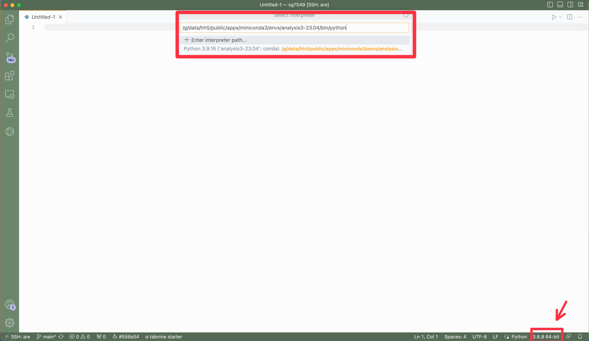

# Working with ARE notebooks in VS Code

VS Code, short for Visual Studio Code, is an incredibly useful code editor that has gained immense popularity among developers. Its versatility and feature-rich environment make it a go-to tool for programmers across different programming languages and platforms. First and foremost, VS Code boasts a user-friendly interface, providing a seamless and intuitive coding experience. Its powerful editing capabilities, including syntax highlighting, code completion, and intelligent debugging, enhance productivity and efficiency. Additionally, VS Code supports a vast range of extensions, enabling developers to customize their environment with functionalities specific to their needs. The integrated source control management and collaboration features further streamline the development workflow, making it easy to work on projects individually or as part of a team. Furthermore, VS Code's lightweight nature and cross-platform compatibility ensure that developers can work effortlessly on different operating systems.

VS Code is also an excellent choice for working with Jupyter Notebooks. Its integration with the Jupyter ecosystem makes it a powerful tool for researchers. With the Jupyter extension in VS Code, users can create, edit, and run Jupyter Notebooks seamlessly within the familiar VS Code environment. This integration brings the benefits of VS Code, such as a user-friendly interface, intelligent code completion, and debugging capabilities, to Jupyter Notebooks. Moreover, VS Code's vast library of extensions provides additional functionality for data exploration, visualization, and machine learning, expanding the possibilities for Jupyter Notebook users. The ability to version control notebooks and collaborate with others further enhances productivity. Overall, the combination of VS Code and Jupyter Notebooks provides a versatile and efficient environment for data analysis and experimentation.

ARE from NCI is a great tool for working with and running Jupyter Notebooks but it lacks the features that VS Code gives you (as described above). The only issue with using VS Code is that it doesn't autmatically have access to computational resources when you connect it to Gadi over ssh. Here we try to overcome this issue so that you can connect VS Code to your active ARE session.

## Step 0: Initial Setup

Before we can start you first need to have VS Code installed onto your local computer/laptop, you can find the download file here: https://code.visualstudio.com

Next you will need to install a few useful extensions in your VS Code, you can click on the extension button on the left bar in VS Code:

- Python
- Jupyter
- Dask
- Remote Explorer
- Remote - SSH
- Remote - SSH: Editing Configuration Files

## Step 1: ARE

Now you should start an ARE (https://are.nci.org.au) JupyterLab session. Once it has started you need to take note of the name of the compute node


For example; the name of the comptue node for this example session is gadi-cpu-bdw-0002.gadi.nci.org.au


## Step 2: SSH Config File

Next you will need to open your local ssh config file. 

### Opening the file:

You can do this easily in 2 ways:

1. Use nano or vim to open the file in edit mode. E.g. using nano: 
    ```bash
    nano ~/.ssh/config
    ```

2. Or you can open the file with VS Code. Search for the file with the open button or there's a really useful shortcut. Click on the Remote Explorer (a.) on the left, then click the settings symbol located on the ssh bar (b.), and finally click on the correct config file (c.), like in the image below:


### Editing the file:

Now that the ssh config file is open you will need to add the following lines of code:

```bash
Host gadi gadi.nci.org.au
  HostName gadi.nci.org.au
  User nci-username

Host are
  Hostname gadi-cpu-bdw-0002.gadi.nci.org.au
  ProxyJump gadi
  User nci-username

Host *
  ForwardX11 yes
  ForwardX11Trusted yes
  AddKeysToAgent yes
  UseKeychain yes
```

 Let's break down each section and explain how it works:

1. The first section:

```bash
Host gadi
  HostName gadi.nci.org.au
  User nci-username
```

In this section, a host named "gadi" is defined. It specifies the hostname as "gadi.nci.org.au" and the user as "nci-username", where you should change "nci-username" to your nci username. This configuration is used to connect to the remote server with the specified hostname using the provided username.

2. The second section:

```bash
Host are
  Hostname gadi-cpu-bdw-0002.gadi.nci.org.au
  ProxyJump gadi
  User nci-username
```

This section defines another host named "are". It specifies the hostname as "gadi-cpu-bdw-0004.gadi.nci.org.au" and the user as "nci-username". Here you need to change "gadi-cpu-bdw-0004.gadi.nci.org.au" to the node name you saved in Step 1: ARE and again you should change "nci-username" to your nci username. The "ProxyJump" directive indicates that the connection to this host should go through the "gadi" host. This configuration is useful when there is an intermediate jump host required to connect to the final destination.

3. The third section:

```bash
Host *
  ForwardX11 yes
  ForwardX11Trusted yes
  AddKeysToAgent yes
  UseKeychain yes
```

This section applies to all hosts and specifies global SSH settings. It enables X11 forwarding (ForwardX11), trusts forwarded X11 connections from unknown hosts (ForwardX11Trusted), adds private keys to the authentication agent (AddKeysToAgent), and uses the macOS Keychain for storing passphrases (UseKeychain). You only need to add the "UseKeychain" line if you are using a Mac.

Finally save the config file.

## Step 3: Connecting to your ARE session.

You should now click the refresh button at the top of your Remote explorer side panel (a). This will show an 'are' option under SSH. Hover over 'are' and click the arrow to connect to it in the current window (b):


## Step 4: Selecting an analysis3 conda env.

When you have succesfully connected to your ssh session on gadi you will now need to tell it where the hh5 conda environments are. 

1. Open up a random python file (doesn't matter what).
2. In the bottom right corner of the window there is a button that shows the python version (e.g. 3.9.12), click on it. Now enter the following into the interpreter path:

```bash
/g/data/hh5/public/apps/miniconda3/envs/analysis3-23.04/bin/python
```
3. This will now be available in the jupyter kernal.



## Final Remarks.

Hopefully you are now running on a compute node where you can edit and run Jupyter notebooks (any any other code that you like, i.e. python scripts, etc) until your ARE session runs out of time.

This method of connecting VScode and 'ARE' is still newly discovered and if you have any problems or suggestions to make it better then please let us know!