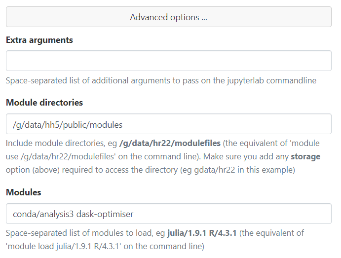
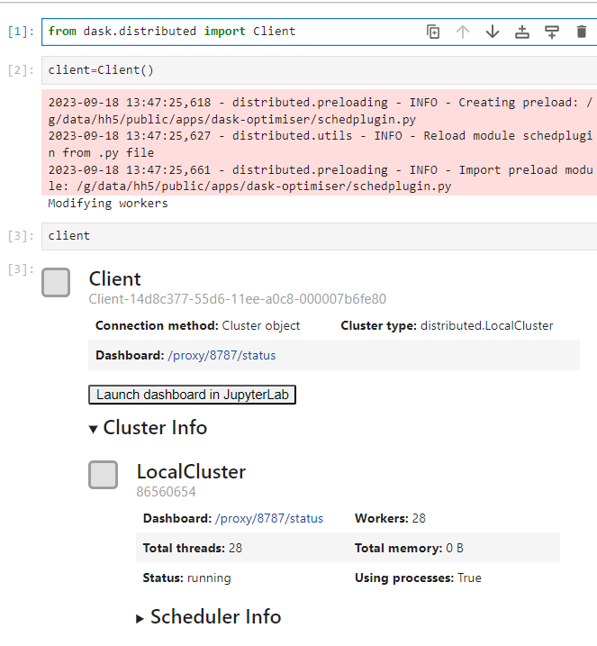
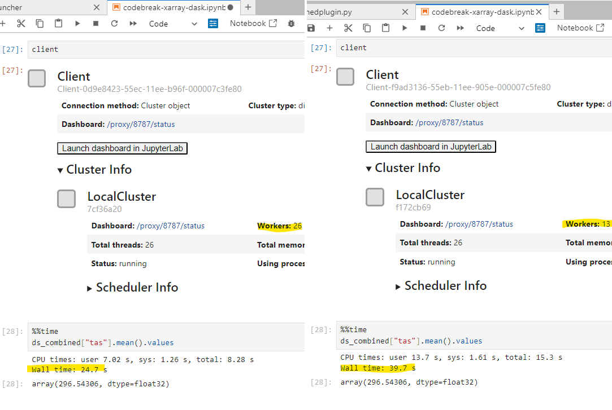

<script src="https://cdn.jsdelivr.net/gh/atteggiani/animated-terminal/animated-terminal.min.js" defer></script>

# Introducing the `dask-optimiser` module

## What is `dask-optimiser` for?

`dask-optimiser` modifies some configuration settings for Dask clusters to provide a more appropriate default configuration when using Dask on Gadi. Dask doesn't really provide a way to setup a global configuration for the `LocalCluster()` cluster type (The standard Dask client setup code (below) launches a `LocalCluster()`).
```
>>> from dask.distributed import Client
>>> client = Client()
```
We feel that this is detrimental when using Dask in an HPC environment. Software designed specifically for HPC settings generally provides a way to set sensible global defaults, but still allow users to customise settings when necessary (e.g. this 'Rationale' box from the [OpenMPI documentation](https://docs.open-mpi.org/en/v5.0.x/mca.html#setting-mca-parameter-values)).

Unfortunately, by lacking the ability to configure global settings, Dask forces all users to either accept a less-than-optimal default setup, or spend time reading documentation and configuring their Dask cluster. There is nothing inherently wrong with this as a method of encouraging Dask users to become more familiar with the software and its configuration options. However, in a research HPC setting resource usage, both computational and human, is critical. From a computational standpoint, `hh5` has over 600 active users, if we can provide some default settings for Dask that can reduce the time a workflow takes by as little as a few percent, when multiplied by the number of users, that represents a significant resource saving across several projects. From a human standpoint, it means that new users can jump straight into using Dask efficiently, and that each `hh5` user doesn't have to spend hours away from their research going over Dask documentation on how to get an efficient cluster set up. Any settings provided directly as arguments to `Client()` or `LocalCluster()` will override the settings provided by this module, so advanced Dask users who are already configuring their clusters do not need to worry about unexpected behaviour.

Most Dask and xarray workflows will benefit from the settings provided by this module, though the larger and more computationally intensive the workflow the better the benefit will be. This module may not work as expected for all Dask cluster types either, we've only tested with the `LocalCluster` and `PBSCluster` types. We also can't test every xarray or Dask workflow run by `hh5`, so we can't guarantee that every problem will benefit from these settings. This is why we've decided to package these settings in a separate module rather than apply them directly to the hh5 `analysis3` environments.  In the most common cases, it should just work, so there is no harm in trying it out. Advanced users should also see some benefit, as this module provides [process binding](#worker-process-binding), which cannot be configured directly by Dask at all.

## How do I use it?
Just load the module. In an interactive PBS job or a PBS job script:

<terminal-window typingDelay=30 lineDelay=200>
    <terminal-line data="input">module use /g/data/hh5/public/modules</terminal-line>
    <terminal-line data="input">module load conda/analysis3</terminal-line>
    <terminal-line data="input">module load dask-optimiser</terminal-line>
    <terminal-line data="input">python3</terminal-line>
    <terminal-line>Python 3.9.17 | packaged by conda-forge | (main, Aug 10 2023, 07:02:31)</terminal-line>
    <terminal-line>[GCC 12.3.0] on linux</terminal-line>
    <terminal-line>Type "help", "copyright", "credits" or "license" for more information.</terminal-line>
    <terminal-line>>>></terminal-line>
</terminal-window>

In ARE Jupyterlab:
Add `dask-optimiser` after your analysis3 module in the `Modules` field


And then launch a dask cluster:


Note the extra messages while `client=Client()` is running. This is because the settings from the module are applied at the end of the cluster launch, and the workers are essentially rebooted with their new configuration if necessary. The `INFO` messages will always appear, as the configuration is applied using a [scheduler preload plugin](https://docs.dask.org/en/stable/how-to/customize-initialization.html). If the plugin detects that the worker configuration should be modified, the `Modifying workers` message will appear. Note that this doesn't appear when a `PBSCluster` is used, as the message is not relayed to the client from the PBS jobs spawned by the cluster.

## Settings Details
 The settings modified by the `dask-optimiser` module are as follows:

 * Sets the default thread count per worker to 1
 * Removes worker memory limit
 * Process binding for dask workers
 * Applies new default PBS flags and module settings to `PBSCluster()`.
 * Sets communication protocol to UCX (`conda_concept` modules only)

These will be explained in more detail below.

### One thread per worker
By default, Dask will detect the number of CPU cores ($n_{cpu}$) it has access to and launch a set number of worker processes each with the same number of threads. The number of processes will be the smallest integer factor of $n_{cpu}$, $n_{w} : n_w \ge \sqrt{n_{cpu}}$, and the number of threads will be $\dfrac{n_{cpu}}{n_w}$. In most cases, this will result in more than one thread per worker. This is less than ideal due to the [Python global interpreter lock](https://realpython.com/python-gil/).

Each thread within a worker process shares memory space, and the global interpreter lock prevents race conditions when multiple threads attempt to make changes to the same object in memory at the same time. For pure Dask, this does not pose much of a problem, as most Dask operations are direct invocations of C maths library operations, and thus do not create, modify or destroy any Python objects while they run. Xarray is quite different, most of the work it does happens within the Python interpreter, meaning many objects are created, modified and destroyed as an Xarray operation runs. The effect of this is that Xarray operations are effectively run in serial in multithreaded environments. This means that when the default Dask `LocalCluster()` settings are used, only $n_w$ Xarray operations can run in parallel. 

By forcing Dask to use one thread per worker, each thread has its own memory space, and cannot be affected by the global interpreter lock being taken by any other thread. Therefore the full $n_{cpu}$ Xarray operations can run in parallel.


### Removed memory worker limit
By default, Dask will detect the amount of memory available on a system, and set a memory limit such that each worker gets an equal share of the system memory, and the sum of the limits is equal to the total memory available. Once again, this is less than ideal for Xarray operations, as quite frequently Xarray workflows may contain a single step that can only use one worker but requires a large amount of memory. When this happens, its quite common for workers to be killed and restarted, and then attempt to run the step again. This can lead to infinite loops where workers end up being killed over and over again wasting a lot of time and resources. By removing the memory limit, PBS will kill the entire job, meaning that a workflow that can never complete due to not having enough memory on the node will not waste your compute grant.

### Worker process binding
This is a more advanced setting, and something that can only be set by a plugin. Dask itself offers no ability to modify process binding. Process binding is where the Linux kernel will restrict the CPU cores that a process has access to as it runs. For some background, the Linux kernel has an in-built scheduler for all processes currently running on a given system, and it will place those processes on CPU cores based on some set of internal heuristics. Processes will typically end up being moved from one CPU core to another a few times a second. In a desktop setting, this is fine as the assumption is that most work done by a process on a  desktop computer is over in a few seconds, so migrating a process to the core on which the kernel thinks it will finish fastest is the best choice.

HPC workloads are different, they tend to run for minutes, hours, or more. When a process is moved, its state needs to be copied across to whichever CPU core the kernel wants to move it to. This movement has some overhead, as the CPU registers and cache for that particular process are effectively reset. By restricting a process to a single CPU core, this migration can never happen, and therefore this overhead is eliminated. Taking advantage of process binding is quite common in other HPC libraries, MPI distributions in particular are configured to automatically apply process binding when run.

Every Dask worker must be bound to a different CPU core, as otherwise some workers will end up sharing CPU cores, and then have to contend for resources. The `dask-optimiser` module contains some logic that runs on each worker when it launches, or when a client with this module loaded is first connected to a cluster. This logic first checks the CPU binding of every existing Dask worker on the node, and finds the next available CPU core (or cores for multi-threaded workers) on which to bind the current worker. It will only perform this binding within a PBS job, and only if the total number of Dask worker threads is less than or equal to the `-lncpus` request of the PBS job. Process binding cannot be disabled when using `dask-optimiser`, so if it is causing problems for your workflow, the best course of action would be to unload the `dask-optimiser` module.

### PBSCluster default settings

The `dask-optimiser` sets applies some default settings to `PBSCluster` initialisation in order to make it more compatible with NCI's custom PBSPro installation. They are as follows:

 * Skip the `select` PBS resource
 * Copy the `-lstorage` flag from the current job or create one if the cluster has been created on a login node
 * Load the current analysis3 module when the worker jobs start
 * Set the Dask cluster to use the Inifinband network

This simplifies the process required to launch a `PBSCluster` on Gadi:

<terminal-window typingDelay=30 lineDelay=150>
<terminal-line data="prompt">from dask_jobqueue import PBSCluster</terminal-line>
<terminal-line data="prompt">cluster = PBSCluster(cores=48,walltime="1:00:00",memory=0,processes=48,queue='normal',resource_spec="ncpus=48,mem=100GB,jobfs=100GB",python="python3")</terminal-line>
<terminal-line data="prompt">cluster</terminal-line>
<terminal-line>PBSCluster(e4bf1e72, 'ucx://10.6.152.1:40908', workers=0, threads=0, memory=0 B)</terminal-line>
<terminal-line>>>></terminal-line>
</terminal-window>

It is necessary to double-specify `cores`, `processes` and `walltime`, as `PBSCluster()` will not launch without those options even if `resource_spec` completely overrides their values. It is also necessary to specify `memory` in both the arguments to `PBSCluster()` and in `resource_spec`. The memory request in `resource_spec` is given to PBS, and the memory request in the `PBSCluster()` arguments is given to the Dask workers.

### UCX communication protocol

This is another more advanced operation, and is only available with the `conda_concept` modules, and only with the `PBSCluster` Dask cluster type. This setting tells Dask to use the [Unified Communication X](https://openucx.org/documentation/) network communication framework. The UCX framework is designed and optimised for the high-bandwidth, low-latency Infiniband networks used by HPC clusters. The `conda_concept` analysis3 environments use the NCI-built `ucx` libraries from `/apps`, which are configured specifically for Gadi's hardware.

## Acknowledgements
Thanks to Davide Marchegiani for [animated-terminal.js](https://github.com/atteggiani/animated-terminal.js).