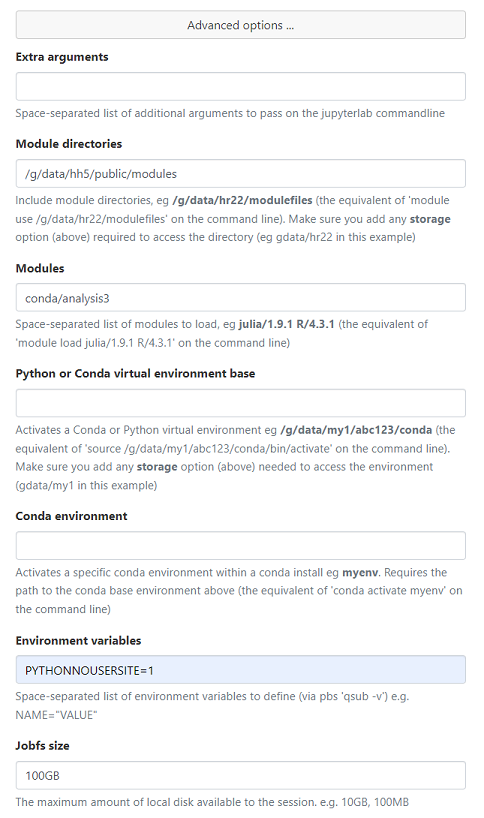
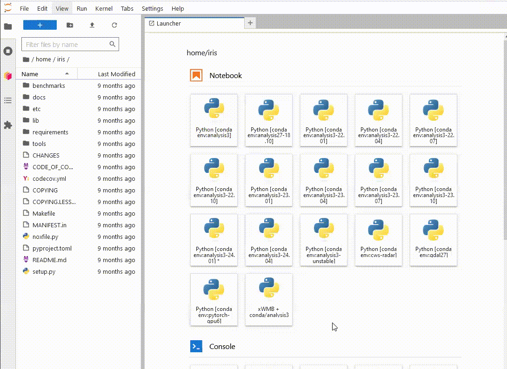

<script src="https://cdn.jsdelivr.net/gh/atteggiani/animated-terminal/animated-terminal.min.js" defer></script>

# Building custom python environments on top of `conda/analysis3`

## Introduction

The conda analysis environments in the `hh5` project are a community-led approach to create a central 
python environment specifically for the analysis of climate and weather data. As such, these environments
contain a wide range of packages curated by the CLEX CMS team that can fulfil the requirements of most 
analysis workflows. 

CMS uses the following guidelines to determine whether a package can go into the `analysis3-unstable`
environment:
 * Is the package available from `conda-forge` or some other reputable conda channel?
 * Is the package in line with the scope of the environment (i.e. climate data analysis)?
 * Is the package actively maintained?
 * Is the package and its dependencies compatible with the existing environment?

If the answer to all of these questions is yes, then CMS will install the package into the environment on request. If, however, these conditions aren't met, that doesn't mean that you need to create a new conda environment
from scratch to use a new package. 

## `pip install --user`

Lets use the [xWMB](https://github.com/hdrake/xwmb) package as an example.
There is no conda distribution for this package, it can only be installed by `pip` from a git repository so it does not meet our criteria above. This
package also has an extensive list of dependencies, most of which are available in the `conda/analysis3` environment, so using the `analysis3` 
environment as a base will save quite a lot of disk space.
 
You may be tempted to load the `conda/analysis3` environment and `pip install --user` the xWMB package.
<terminal-window typingDelay=30 lineDelay=200>
    <terminal-line data="input">module use /g/data/hh5/public/modules</terminal-line>
    <terminal-line data="input">module load conda/analysis3</terminal-line>
    <terminal-line data="input">pip install -\\\-user git+https://github.com/hdrake/xwmb.git@main</terminal-line>
    <terminal-line>Collecting git+https://github.com/hdrake/xwmb.git@main</terminal-line>
    <terminal-line>  Cloning https://github.com/hdrake/xwmb.git (to revision main) to /scratch/v45/dr4292/tmp/pip-req-build-qox565pe</terminal-line>
    <terminal-line>  Running command git clone -\\\-filter=blob:none -\\\-quiet https://github.com/hdrake/xwmb.git /scratch/v45/dr4292/tmp/pip-req-build-qox565pe</terminal-line>
    <terminal-line>  ...</terminal-line>
    <terminal-line>Successfully installed regionate-0.0.1 sectionate-0.2.1 xbudget-0.1.0 xgcm-0.8.2.dev15+g7492277 xwmb-0.1.1 xwmt-0.1.1</terminal-line>
</terminal-window>

The trouble with this is that it can lead to problems in the future. The `analysis3` module
is updated to every 3 months as new environments are released. For example, if you load `conda/analysis3` today,
you'll get the `conda/analysis3-24.01` environment. If you were to load the same module a couple of months from
now, you'll get the `conda/analysis3-24.04` environment. Our policies around updating the conda environments
can be found [here](https://climate-cms.org/cms-wiki/services/services-conda.html). As time goes on, your
locally installed package will get further and further out of date, and could potentially conflict with newer
packages installed in updated analysis environments. 

This is one of the most common issues we see come into our helpdesk. A user will open a JupyterLab session in ARE
and an important package like `dask` or `xarray` will fail to import due to a conflict in the user's local
environment. In fact, in our advice to users, we recommend the following Advanced Settings for ARE environments:



Note the `PYTHONNOUSERSITE=1` environment variable. This will have the effect of preventing anything installed with `pip install --user` from loading at all.

## Virtual envrionments
Instead, we recommend creating a [virtual environment](https://docs.python.org/3/library/venv.html). A virtual environment is a self-contained Python
environment built on top of an existing Python installation. The self-contained
nature of a virtual environment means that any issues due to conflicting 
dependencies can be avoided entirely. Being able to base the environment on top of
an existing `conda/analysis3` environment means that the installation can be kept
small, as most of the dependencies will have already been satisfied. 

There are only two additional commands required to install `xWMB` into a virtual environment, as shown below:
<terminal-window typingDelay=30 lineDelay=200>
    <terminal-line data="input">module use /g/data/hh5/public/modules</terminal-line>
    <terminal-line data="input">module load conda/analysis3</terminal-line>
    <terminal-line data="input">python3 -m venv xwmb_venv -\\\-system-site-packages</terminal-line>
    <terminal-line data="input">source xwmb_venv/bin/activate</terminal-line>
    <terminal-line data="input" inputChar="(xwmb_venv) $">pip install git+https://github.com/hdrake/xwmb.git@main</terminal-line>
    <terminal-line>Collecting git+https://github.com/hdrake/xwmb.git@main</terminal-line>
    <terminal-line>  Cloning https://github.com/hdrake/xwmb.git (to revision main) to /scratch/v45/dr4292/tmp/pip-req-build-qox565pe</terminal-line>
    <terminal-line>  Running command git clone -\\\-filter=blob:none -\\\-quiet https://github.com/hdrake/xwmb.git /scratch/v45/dr4292/tmp/pip-req-build-qox565pe</terminal-line>
    <terminal-line>  ...</terminal-line>
    <terminal-line>Successfully installed regionate-0.0.1 sectionate-0.2.1 xbudget-0.1.0 xgcm-0.8.2.dev15+g7492277 xwmb-0.1.1 xwmt-0.1.1</terminal-line>
</terminal-window>
```{warning}
Do not use `pip install --user` here, as this will result in the packages being installed in your `~/.local` directory, leaving the virtual environment empty
```

And that's it. We now have a fully self-contained environment with a custom 
package built on top of the `conda/analysis3` environment. It is important to note
that this virtual environment is tied to the version of `conda/analysis3` that was loaded
at the time of its creation, so it avoids the out-of-date dependencies issue mentioned earlier.
<terminal-window typingDelay=30 lineDelay=200>
    <terminal-line data="input" inputChar="(xwmb_venv) $">which python3</terminal-line>
    <terminal-line>~/xwmb_venv/bin/python3</terminal-line>
    <terminal-line data="input" inputChar="(xwmb_venv) $">ls -l ~/xwmb_venv/bin/python3</terminal-line>
    <terminal-line>lrwxrwxrwx 1 dr4292 v45 67 Jun  5 14:43 /home/563/dr4292/xwmb_venv/bin/python3 -> /g/data/hh5/public/apps/miniconda3/envs/analysis3-24.01/bin/python3</terminal-line>
</terminal-window>

There are a few different ways that this virtual environment can be used in scripts.
Immediately after loading the `conda/analysis3` module, you can place the command
`source xwmb_venv/bin/activate` in your script and any `python` command or 
script with a `#!/usr/bin/env python` [shebang line](https://en.wikipedia.org/wiki/Shebang_(Unix)) 
will now run under the new virtual environment. If you're running a script directly, you can
change the path in the shebang line to the path to the `python` symlink in the virtual environment:
```
#!/home/563/dr4292/xmhw_venv/bin/python3

import xwmb
...
```

## Troubleshooting
Virtual environments are designed to be disposable, so if something goes wrong, instead of trying
to fix the environment in place, it is safe to simply delete the environment and start again.
There are many reasons this might need to happen, for example, you're installing an old
package that is not compatible with e.g. `numpy` installed in the `conda/analysis3` environment.
In that case, you could simply delete the environment, load an older `conda/analysis3` environment
and re-create it.

<terminal-window typingDelay=30 lineDelay=200>
    <terminal-line data="input" inputChar="(xwmb_venv) $">deactivate</terminal-line>
    <terminal-line data="input">rm -rf xwmb_venv</terminal-line>
    <terminal-line data="input">module unload conda</terminal-line>
    <terminal-line data="input">module load conda/analysis3-23.01</terminal-line>
    <terminal-line data="input">python3 -m venv xwmb_venv --system-site-packages</terminal-line>
    <terminal-line data="input">source xwmb_venv/bin/activate</terminal-line>
    <terminal-line data="input" inputChar="(xwmb_venv) $">pip install git+https://github.com/hdrake/xwmb.git@main</terminal-line>
</terminal-window>

In a similar vein, if you're installing more packages into a virtual environment and they
begin to conflict with each other, the best course of action is to create a new virtual environment.
Virtual environments are isolated from each other, so rather than creating large, monolithic 
environments, it is common practice to create virtual environments for a single package, and have
multiple virtual environments depending on your immediate requirements.

In general, if anything in the environment doesn't work for whatever reason, the best course of action
is to delete it and try again. You may need to try different `conda/analysis3` environments, or, if none of those
work, use one of the NCI installed Python modules as your base. 
```{note}
NCI's Python modules do not have `dask`, `xarray`, etc. installed, so the resultant virtual environments could be quite large.
```


## Jupyter Kernel
There is one more step necessary to have your new virtual environment usable as a kernel in an ARE JupyterLab session. 
You'll need to call `ipykernel install` while the virtual environment is activated.
<terminal-window typingDelay=30 lineDelay=200>
    <terminal-line data="input">module use /g/data/hh5/public/modules</terminal-line>
    <terminal-line data="input">module load conda/analysis3</terminal-line>
    <terminal-line data="input">source xwmb_venv/bin/activate</terminal-line>
    <terminal-line data="input" inputChar="(xwmb_venv) $">python3 -m ipykernel install -\\\-user -\\\-name xwmb-venv -\\\-display-name "xWMB + conda/analysis3"</terminal-line>
</terminal-window>

```{note}
Since this virtual environment is built on top of `conda/analysis3`, you do not need to install `ipykernel` in it, as this is already present in the conda environment. 
```

Now, when
you launch a new ARE JupyterLab instance, you will be able to see your new environment,
launch a notebook and import the `xWMB` package



You only have to do this once. If you delete the environment and recreate it at the same path,
Jupyterlab will still be able to use it.

## Summary

While we try to make the `hh5` conda analysis environments as comprehensive as possible, we can't 
always install the packages you need. By creating a virtual environment using the `conda/analysis3` 
environment as your base,
its possible to add in packages we can't install, without having the overhead of maintaining
your own large conda environment. Furthermore, using a virtual environment avoids the 
headaches associated with installing software using `pip install --user` as anything 
installed will be pinned to a specific conda environment. Virtual environments are simple to
install, and simple to delete and re-create as necessary. 


## Acknowledgements
Thanks to Davide Marchegiani for [animated-terminal.js](https://github.com/atteggiani/animated-terminal.js).